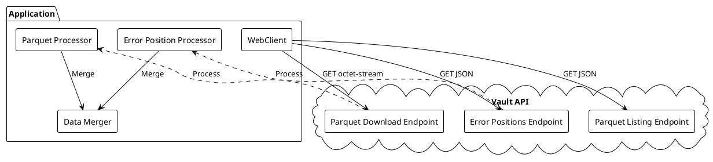
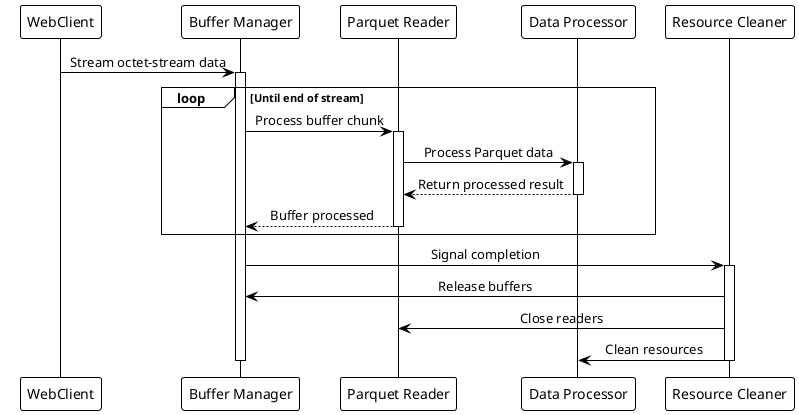
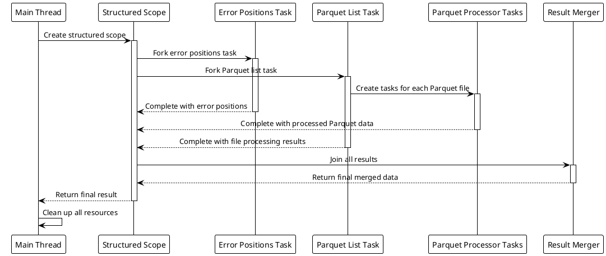

# Vault Multi-Endpoint API Integration - Architecture Decision Records

## ADR001: Vault API Integration Approach

### Status
Proposed

### Context
Our Java 21 / Spring Boot 3 application needs to integrate with Vault's new multi-endpoint API, which now separates:
- Error position information (JSON format)
- Parquet file listings for a job
- Individual Parquet file download endpoints (returning application/octet-stream)

The application currently uses RestTemplate for API integrations, but we should consider adopting more modern approaches. This integration needs to handle potentially large files (up to 50MB per Parquet file) efficiently, with the data processing happening daily for a small number of jobs.

### Options Considered

#### Option 1: Continue Using RestTemplate
- Use existing RestTemplate configuration for Vault API integration
- Update to handle the new multi-endpoint structure
- **Pros:**
  - Familiar to the team
  - No learning curve
  - Consistent with existing codebase
- **Cons:**
  - Being deprecated in favor of WebClient
  - Limited support for efficient streaming
  - Blocking nature can impact resource utilization

#### Option 2: Migrate to WebClient
- Use Spring WebClient to consume the Vault API endpoints
- Leverage its streaming capabilities for large octet-stream downloads
- **Pros:**
  - Modern replacement for RestTemplate
  - Superior streaming support for binary data
  - Non-blocking capabilities
  - Better memory management for large responses
- **Cons:**
  - Migration effort from RestTemplate
  - Learning curve for team members unfamiliar with reactive programming
  - Potential complexity in error handling

#### Option 3: Use Feign Client with Resilience4j
- Implement Vault API integration using OpenFeign client
- Add Resilience4j for circuit breaking and retries
- **Pros:**
  - Declarative REST client with minimal boilerplate
  - Built-in resilience patterns
  - Clean interface-based approach
- **Cons:**
  - Not well-suited for large binary file downloads
  - Limited streaming capabilities
  - Additional dependencies

### Decision
Selected **Option 2: Migrate to WebClient** because:
- Provides superior support for streaming binary data (octet-stream) efficiently
- Offers better memory management through non-blocking I/O
- Represents the strategic direction for Spring's HTTP client support
- Enables efficient handling of both JSON and binary data streams
- Allows for controlled backpressure when processing large files

### Consequences
- Gradual migration from RestTemplate to WebClient will be needed
- Team members will need to become familiar with WebClient API
- Will need to implement proper resource cleanup in WebClient usage
- More efficient memory utilization and better handling of large payloads

### Architecture Diagram



---

## ADR002: Parquet File Processing Strategy

### Status
Proposed

### Context
The application needs to download and process Parquet files that are delivered as octet-stream data from the Vault API. Each file can be up to 50MB. We need an efficient approach to:
- Download these potentially large binary streams
- Convert octet-stream to Parquet format for processing
- Parse the Parquet format
- Merge with error position data from a separate endpoint
- Process everything in a memory-efficient way
- Ensure complete memory cleanup after processing

### Options Considered

#### Option 1: Full In-Memory Byte Array Processing
- Download entire octet-stream into byte arrays in memory
- Convert to ByteArrayInputStream for Parquet processing
- Process using standard Apache Parquet libraries
- **Pros:**
  - Simple implementation
  - Direct processing path
  - Common approach for Parquet processing
- **Cons:**
  - High memory consumption for multiple files
  - Potential OutOfMemoryErrors under load
  - Complete file must be in memory before processing starts

#### Option 2: Streaming Buffer Processing
- Stream octet-stream data through fixed-size buffers
- Use InputStreams with Apache Parquet libraries
- Process data as it arrives rather than waiting for complete download
- **Pros:**
  - More memory efficient
  - Processing can begin before download completes
  - Controlled buffer sizes prevent memory spikes
- **Cons:**
  - More complex implementation
  - Requires careful stream management
  - Need to handle streaming errors properly

#### Option 3: Memory-Mapped Buffer Approach
- Download to temporary ByteBuffers
- Use memory-mapped approach for efficient reading
- **Pros:**
  - Efficient memory usage for large files
  - Good performance characteristics
  - Works well with Java NIO
- **Cons:**
  - More complex implementation
  - Potential native memory issues if not managed properly
  - Requires more careful resource cleanup

### Decision
Selected **Option 2: Streaming Buffer Processing** because:
- Provides memory-efficient processing of large octet-stream data
- Enables processing to start before complete file is downloaded
- Works well with WebClient's streaming capabilities
- Prevents large memory spikes when processing multiple files
- Better supports the atomic processing requirement with controlled resource usage

### Consequences
- Need to implement proper stream handling and buffer management
- Must ensure all streams are properly closed after processing
- More controlled memory usage patterns
- Slightly more complex implementation but better scalability

### Architecture Diagram



---

## ADR003: Memory Management Strategy

### Status
Proposed

### Context
Processing large Parquet files (up to 50MB each) delivered as octet-stream requires careful attention to memory management. We need to ensure that resources are properly released after processing, treating each job as an atomic operation that completely cleans up after completion.

### Options Considered

#### Option 1: Rely on Garbage Collection
- Use standard Java objects and references
- Let JVM garbage collection handle memory cleanup
- **Pros:**
  - Simplest implementation
  - Standard Java approach
  - No custom cleanup code
- **Cons:**
  - Unpredictable memory release timing
  - May lead to memory pressure during peak load
  - No explicit control over resource cleanup

#### Option 2: Manual Resource Management
- Explicitly close and dispose all streams and resources
- Use try-with-resources for all closeable objects
- Nullify references when processing completes
- **Pros:**
  - Deterministic resource cleanup
  - Better control over memory usage
  - More predictable memory footprint
- **Cons:**
  - Requires careful implementation
  - Risk of resource leaks if any cleanup is missed
  - More verbose code

#### Option 3: Resource Cleanup Framework
- Implement a custom resource tracking framework
- Register all resources created during a job
- Automatically clean up all registered resources at job completion
- **Pros:**
  - Centralized resource management
  - Lower risk of missed cleanups
  - Clear tracking of all allocated resources
- **Cons:**
  - Additional framework to maintain
  - Overhead of resource registration
  - More complex implementation

### Decision
Selected **Option 2: Manual Resource Management** because:
- Provides deterministic cleanup of resources after job processing
- Ensures each job processing is truly atomic with respect to memory usage
- Takes advantage of Java 21's enhanced try-with-resources and AutoCloseable pattern
- Simpler to implement correctly than a custom framework
- Direct control over when resources are released

### Consequences
- Need to implement consistent cleanup patterns throughout the code
- Will require careful code reviews to ensure all resources are properly closed
- More predictable memory usage patterns
- Reduced risk of memory leaks or excessive memory consumption

### Architecture Diagram

```plantuml
@startuml
!theme plain
skinparam activityDiamondBackgroundColor white

start
:Create ResourceRegistry for job;

fork
  :Fetch error positions;
  :Process error positions;
fork again
  :Get Parquet file list;
  
  while (more files?) is (yes)
    :Open stream from API;
    :Process Parquet data;
    :Close stream;
  endwhile (no)
end fork

:Merge results;
:Process final data;

|Cleanup|
:Close all registered resources;
:Release all buffers;
:Clear all references;
stop

@enduml
```

---

## ADR004: Error Position Correlation Strategy

### Status
Proposed

### Context
The application needs to correlate error positions (received from one endpoint in JSON format) with the actual data in Parquet files (from separate endpoints). This correlation must be efficient and accurate for daily processing jobs, while maintaining our atomic processing approach.

### Options Considered

#### Option 1: Sequential Processing
- Download error positions first
- Then download and process each Parquet file sequentially
- Join error data with Parquet data during processing
- **Pros:**
  - Simple implementation
  - Minimal concurrency complexity
  - Predictable resource usage
  - Easier to ensure complete cleanup
- **Cons:**
  - Slower overall processing time
  - Inefficient for multiple files
  - Under-utilizes modern multi-core processors

#### Option 2: Parallel Processing with CompletableFuture
- Download error positions and Parquet file list concurrently
- Process Parquet files in parallel using CompletableFuture
- Join results when all processing completes
- **Pros:**
  - Better performance through parallelism
  - Efficient use of system resources
  - Built-in Java API
  - Appropriate for daily batch processing
- **Cons:**
  - More complex error handling
  - Careful thread pool management required
  - Resource cleanup must account for all parallel tasks

#### Option 3: Structured Concurrency (Java 21)
- Leverage Java 21's structured concurrency features
- Use virtual threads to handle parallel processing
- Ensure all threads complete before resources are released
- **Pros:**
  - Modern approach using Java 21 features
  - Automatic child thread management
  - Simplified error handling across threads
  - Natural fit for atomic operations
- **Cons:**
  - New API with less community experience
  - Different programming model
  - May require team training

### Decision
Selected **Option 3: Structured Concurrency (Java 21)** because:
- Takes advantage of the latest Java 21 capabilities
- Structured concurrency model aligns perfectly with atomic operation requirements
- Provides a clean approach to parallel processing with proper resource scoping
- Ensures all subtasks complete (successfully or with errors) before releasing resources
- More efficient than sequential processing while maintaining clean resource management

### Consequences
- Team will need to learn structured concurrency patterns
- Need to carefully implement scoped values for resource sharing
- Will benefit from improved error handling across concurrent operations
- Processing performance will scale better with multiple files
- Resource cleanup will be more deterministic after job completion

### Architecture Diagram


